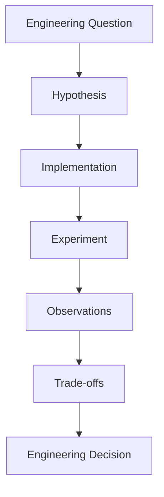

# Engineering Decisions

> Reproducible engineering decisions through hands-on cloud-native laboratories.

Engineering Decisions is a curated collection of reproducible laboratories that explore real engineering decisions in cloud-native systems.

Instead of introducing services or summarizing documentation, each Engineering Decision starts with a practical question, builds a working implementation, validates it through experimentation, and documents the tradeoffs behind the final decision.

The goal is simple:

> Help engineers understand not only **how** to build something, but also **why** one implementation may be a better decision than another.

---

## What Makes This Project Different?

Engineering Decisions is not a collection of tutorials, service overviews, or feature walkthroughs.

Each laboratory begins with a real engineering question, validates a hypothesis through reproducible experiments, and documents the reasoning behind the final decision.

The goal is not to prescribe universal answers, but to provide evidence that helps engineers make better decisions in their own environments.

> Engineering is not about choosing the most advanced technology. It's about making the most appropriate decision with the evidence available.

---

## Philosophy

Modern cloud platforms abstract an increasing amount of infrastructure.

Engineering decisions, however, cannot be abstracted.

Every laboratory in this repository follows the same principle:

- Start with a real engineering question.
- Build a reproducible implementation.
- Observe the results.
- Explain the tradeoffs.
- Share the reasoning behind the final decision.

The objective is not to find universal answers, but to provide enough evidence for engineers to make informed decisions in their own environments.

---

## Repository Structure

```text
engineering-decisions/

├── decisions/
│   ├── 001-abstracting-nodes-not-accountability/
│   ├── 002-what-auto-mode-doesnt-abstract/
│   ├── 003-ecs-vs-eks-auto-mode/
│   └── ...
│
├── diagrams/
│
├── docs/
│
├── scripts/
│
└── assets/
```

Each decision is self-contained and typically includes:

- Problem statement
- Architecture
- Source code
- Infrastructure
- Experiment
- Results
- Tradeoffs
- Production considerations
- Related article

---

## Engineering Decision Framework

Every laboratory is built around a single engineering question. The outcome is not a definitive answer, but evidence that informs future decisions.



---

## Principles

Every Engineering Decision should be:

- Reproducible
- Practical
- Evidence-based
- Production-oriented
- Vendor-aware, but engineering-first

---

## Related Articles

The technical narrative behind each laboratory is published separately as long-form engineering articles.

The repositories contain the complete implementation.

The articles explain the engineering reasoning.

---

## License

This project is released under the terms of the repository license.
